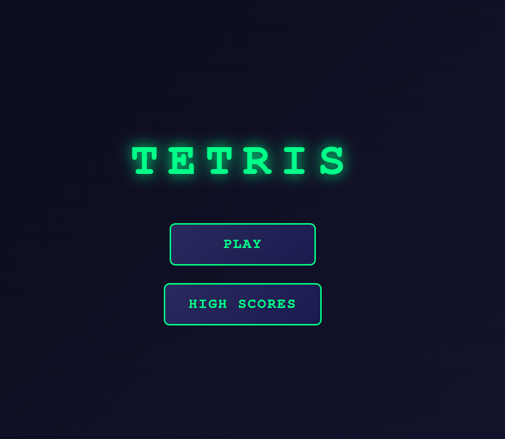
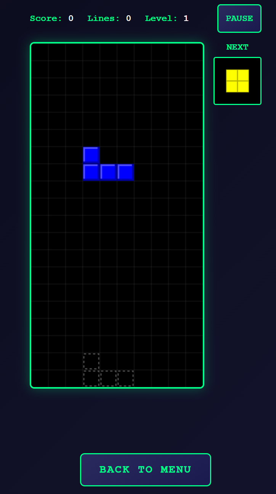

# Tetris JS 🎮

A fully responsive Tetris game built with vanilla JavaScript, featuring mobile-friendly touch controls, high score tracking, and classic Tetris gameplay.

<a href="docs/screenshot-menu.png"></a>

## Features

### 🎯 Core Gameplay

- **Complete Tetris mechanics**: All 7 classic Tetris pieces (I, O, T, S, Z, J, L)
- **Line clearing**: Full rows are cleared with visual effects
- **Scoring system**: Points for lines cleared, level progression, and hard drops
- **Progressive difficulty**: Speed increases with each level
- **Ghost piece**: Shows where the current piece will land

<a href="docs/screenshot-game.png"></a>

### 📱 Mobile-Friendly Design

- **Fully responsive**: Adapts to any screen size
- **Touch controls**: Intuitive buttons for mobile devices
- **Swipe gestures**: Alternative touch input method
- **Optimized layout**: Mobile-first design approach

<a href="https://github.com/user-attachments/assets/bdc74586-9f77-4d75-a118-203f36bd7e31"></a>

### 🏆 High Score System

- **Local storage**: Scores are saved automatically
- **Top 10 leaderboard**: Track your best performances
- **Detailed stats**: Score, lines cleared, level, and date
- **Persistent data**: Scores remain after browser restart

<a href="https://github.com/user-attachments/assets/1c5d4179-05a3-4ffb-b4bd-2e314fcf6364"></a>

### 🎵 Audio & Visual Features

- **Background music**: Classic Tetris theme (placeholder included)
- **Visual effects**: Line clearing animations and piece shadows
- **Modern UI**: Neon-style interface with smooth animations
- **Pause functionality**: Game can be paused/resumed at any time

## Controls

### Desktop (Keyboard)

- **Arrow Keys**: Move and rotate pieces
  - `←` / `→`: Move left/right
  - `↓`: Soft drop (faster fall)
  - `↑`: Rotate piece
- **Spacebar**: Hard drop (instant fall)
- **P** or **Escape**: Pause/resume game

### Mobile (Touch)

- **Touch buttons**: On-screen controls for all actions
- **Swipe gestures**:
  - Swipe left/right: Move piece
  - Swipe down: Soft drop
  - Swipe up: Hard drop
  - Tap: Rotate piece

## Installation & Usage

1. **Clone or download** the repository
2. **Open** `index.html` in a web browser
3. **Start playing** - no build process required!

For local development with a web server:

```bash
python3 -m http.server 8000
# Then visit http://localhost:8000
```

## Project Structure

```
tetris-js/
├── index.html              # Main HTML file
├── styles/
│   └── main.css            # Responsive CSS styles
├── src/
│   ├── core/               # Core game logic
│   │   ├── pieces.js       # Tetris piece definitions
│   │   ├── board.js        # Game board management
│   │   └── game.js         # Main game engine
│   ├── ui/                 # User interface
│   │   ├── renderer.js     # Canvas rendering
│   │   ├── controls.js     # Input handling
│   │   └── screens.js      # Screen management
│   ├── storage/
│   │   └── highscores.js   # High score management
│   └── app.js              # Application initialization
└── assets/
    └── tetris-theme.mp3    # Background music (placeholder)
```

## Game Mechanics

- **Line Scoring**:
  - Single: 100 × level
  - Double: 300 × level
  - Triple: 500 × level
  - Tetris (4 lines): 800 × level
- **Level Progression**: Every 10 lines cleared
- **Speed Increase**: Gets faster each level
- **Hard Drop Bonus**: 2 points per cell dropped

## Browser Compatibility

- ✅ Chrome/Chromium (recommended)
- ✅ Firefox
- ✅ Safari
- ✅ Edge
- ✅ Mobile browsers (iOS Safari, Chrome Mobile)

## Technical Features

- **Vanilla JavaScript**: No frameworks or dependencies
- **Canvas Rendering**: Smooth 60fps gameplay
- **LocalStorage**: Persistent high scores
- **Responsive Design**: CSS Grid and Flexbox
- **Touch Events**: Full mobile support
- **Keyboard Handling**: Proper key repeat and prevention

## Customization

The game can be easily customized by modifying:

- **Colors**: Edit piece colors in `src/core/pieces.js`
- **Scoring**: Modify point values in `src/core/game.js`
- **Styling**: Update CSS in `styles/main.css`
- **Controls**: Change key bindings in `src/ui/controls.js`

## License

Open source - feel free to use, modify, and distribute!
